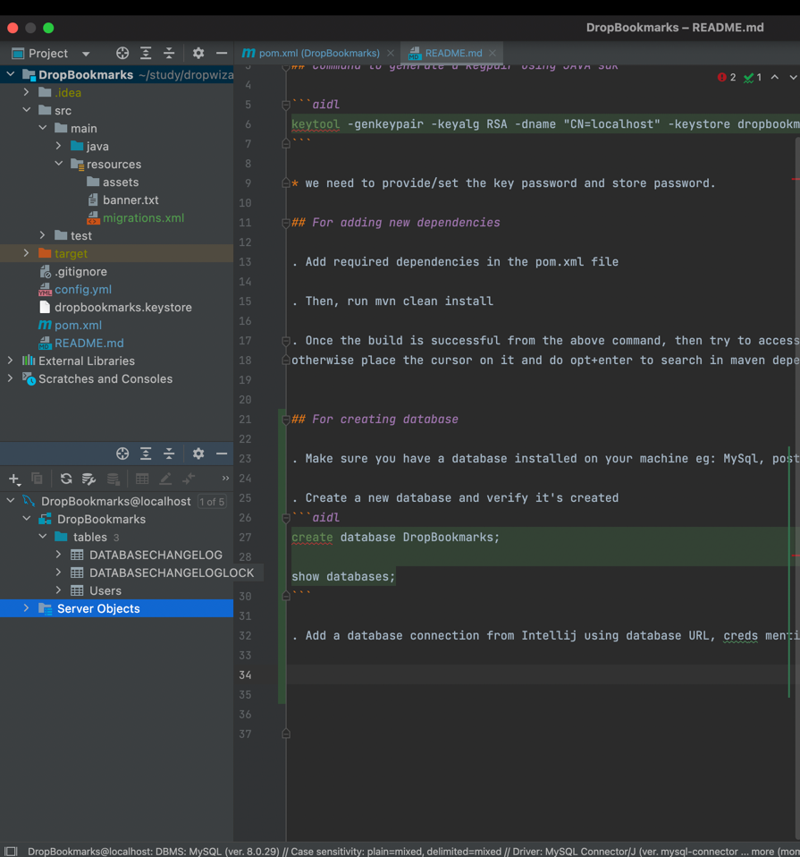

# HTTPS

## Command to generate a keypair using JAVA sdk

```aidl
keytool -genkeypair -keyalg RSA -dname "CN=localhost" -keystore dropbookmarks.keystore -keypass <key password> -storepass <store password>
```

* we need to provide/set the key password and store password.

## For adding new dependencies

. Add required dependencies in the pom.xml file

. Then, run mvn clean install

. Once the build is successful from the above command, then try to access the library/package specific function,variable,class, etc.. if IDE shows it then good , 
otherwise place the cursor on it and do opt+enter to search in maven dependency and add it. Also, tru the "reload from disk and rebuild the project", sometimes it also works fine.


## For creating database

. Make sure you have a database installed on your machine eg: MySql, postgresql, etc..

. Create a new database and verify it's created 
```aidl
create database DropBookmarks;

show databases;
```

. Add a database connection from Intellij using database URL, creds mentioned on pom.xml and config.yml and verify the connection, like the below image.



## execute liquibase migration scripts
. We need to make sure we have a liquibase migration scripts in allowed format by liquibase(i.e., in xml/sql/json/etc.. format) in our [src/main/resources](src/main/resources) folder.

. Make sure we have our database created in our local database.

. Run ```mvn liquibase:update``` to execute the liquibase migration scripts.

