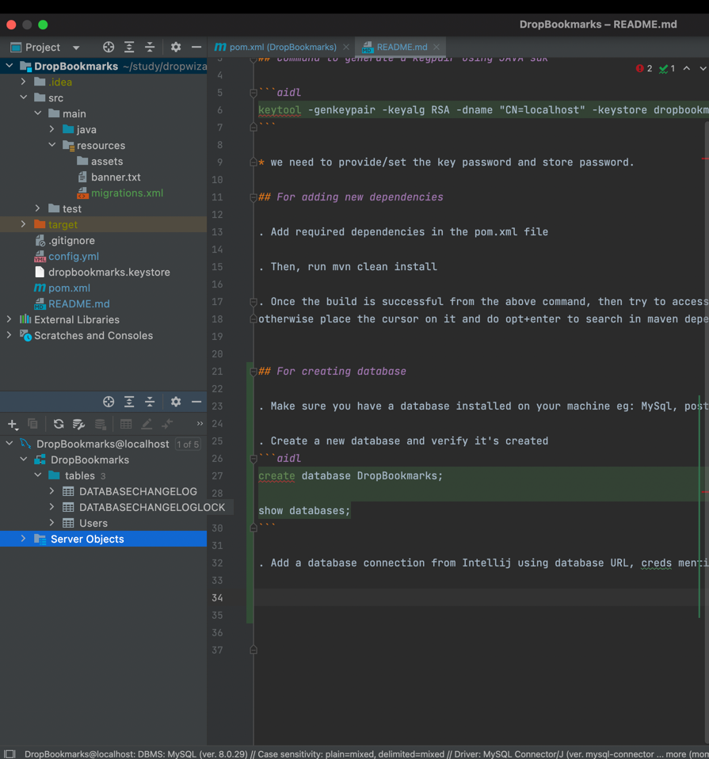
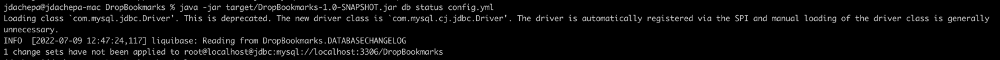
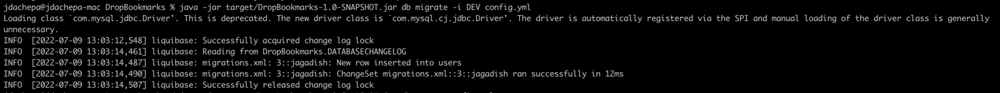

# HTTPS

## Command to generate a keypair using JAVA sdk

```aidl
keytool -genkeypair -keyalg RSA -dname "CN=localhost" -keystore dropbookmarks.keystore -keypass <key password> -storepass <store password>
```

* we need to provide/set the key password and store password.

## For adding new dependencies

### via CLI:

. Add required dependencies in the pom.xml file

. Then, run mvn clean install

. Once the build is successful from the above command, then try to access the library/package specific function,variable,class, etc.. if IDE shows it then good , 
otherwise place the cursor on it and do opt+enter to search in maven dependency and add it. Also, tru the "reload from disk and rebuild the project", sometimes it also works fine.

### via IntelliJ IDE:

. Add required dependencies in the pom.xml file

. Then, rebuild the project

. If not worked, then open maven window in intelliJ -> View > Tool Windows > Maven

. Then, click on resync ("reload all maven projects") icon

## For creating database

. Make sure you have a database installed on your machine eg: MySql, postgresql, etc..

. Create a new database and verify it's created 
```aidl
create database DropBookmarks;

show databases;
```

. Add a database connection from Intellij using database URL, creds mentioned on pom.xml and config.yml and verify the connection, like the below image.


View Database from intelliJ IDE:

View > Tool Windows > Database


## execute liquibase migration scripts
. We need to make sure we have a liquibase migration scripts in allowed format by liquibase(i.e., in xml/sql/json/etc.. format) in our [src/main/resources](src/main/resources) folder.

. Make sure we have our database created in our local database.

. RUN the below commands accordingly:

. ```mvn liquibase:dropAll``` -> to clear the database i.e., reset.

. ```mvn liquibase:updateSQL -Dliquibase.contexts=DEV``` -> to generate SQL commands from changeSets.

. ```mvn liquibase:update``` -> to execute the liquibase migration scripts.

. ```cat target/liquibase/migrate.sql``` -> to view the generated SQL script.

. ```mvn liquibase:rollbackSQL -Dliquibase.rollbackCount=<no. of changesets to rollback i.e., 1/2/3/etc..>``` -> to generate SQL script for the rollback commands mentioned in our changeSets.

. ```mvn liquibase:rollback -Dliquibase.rollbackCount=<no. of changesets to rollback i.e., 1/2/3/etc..>```  -> to rollback on the database.

. ```mvn liquibase:generateChangeLog``` -> to generate the xml formatted changeSets from the database and create a new output xml file using that generated content. Ensure we have the "<outputChangeLogFile>" property in pom.xml under the plugins> liquibase' plugin > configuration.


## Database refactoring using CLI

. Run ```java -jar target/DropBookmarks-1.0-SNAPSHOT.jar db status config.yml``` to check how many migrations(changeSets) are yet to apply to the database. Refer below pic.



. Run ```java -jar target/DropBookmarks-1.0-SNAPSHOT.jar db migrate -i DEV config.yml``` to execute the YET TO APPLY changeSets. Refer below pic.


. Other available commands for db: 
    positional arguments:
        {calculate-checksum,clear-checksums,drop-all,dump,fast-forward,generate-docs,locks,migrate,prepare-rollback,rollback,status,tag,test}


